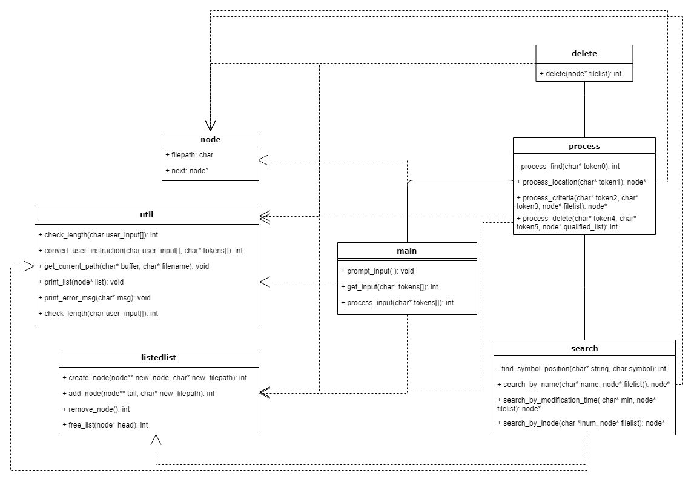

# Operating System Project3 - Linux File System Demo

It is a demo for file search program on Linux, where users can find and delete files by various metadata.

## The Purpose of the Project

The Linux file system plays an important role in the programming world. Linux and other Unix-like operating systems maintain stability by treating everything as a file, including input devices, hard-disks, processes, and even the directories. In other words, files are the basic blocks in the programming world and thus an elegant file management system is critical. 

In this project, by creating a simple version of Linux “find” utility in the file system, we, as students, can understand the lower level of system structure deeply. 

By simulating the find function involving directory file list extraction, we can learn the mechanism behind the Linux file system. By simulating the criteria and delete function, we can explore the concept of “file” in Linux in terms of its definition, category and usage. For example, inode which stores the attributes and disk block location(s) of the file, is a critical concept in the Linux file system. After implementing inode-related functions, we develop a deeper understanding of the concept. Upon completion of the project, we practice the concepts learned in our class and gain insight into the operating system used everyday. 

## The flowchart

## Explanation

**Node.h** is comprised of a pointer to char that stores the file path of the current node and a pointer that points to the next node. 

**Listedlist.c** is a controller of nodes, allowing the users to create, add, and remove the nodes and free the memory. 

**Util.c** is a utility function containing helper functions such as input-length checker, user input converter, list printer and so on.

**Main.c** will prompt the instruction first, then get and process the user instruction. 

**Process.c** is a branch manager directing to different functions based on the user input passed from the main function. 

**Search.c** searches for files based on the criterion chosen by the user (e.g, search by file name, modification time or inode number).

**Delete.c** is a file remover that deletes the files returned by the search function

## Challenges and Solutions

### 1.Time & Team Management

Challenge: 

As it is the first time for all of us to team up on a project with little knowledge about each other’s background, it is not easy to accurately identify the issues that might arise in the development process and estimate the time will be spent on solving them in advance.
Also, for a team of four people, the adoption of a good collaboration process and tools is necessary for working efficiently and effectively. It is a challenge to pick/design and enforce such a process where the agile practice can be fully utilized.

Solution:

We held meetings once or twice a week where we did not only talk about tasks but also encouraged questions and feedback. In that way, we managed to know more about each other as an individual professionally and revealed hidden problems as soon as possible.
Also, we adopted Google Doc for meeting notes and Github for code version control. The meeting notes were taken alternatively to promote the sense of ownership of the tool. And we also encouraged people with more experience with Github to share their tips with others and help troubleshooting.

### 2.Design with Regard to Multiple Quality Attributes

Challenge: 

As a small-size course project, robustness and usability are of high priority among all other quality attributes. It is a challenge to ensure the robustness and usability of the “find” utility under several feature requirements and various combinations of user-input and file status. 

Solution:

We focused our early meetings on discussing requirements and trade-off. When there was ambiguity in the quality requirement, we brought professor in for his insight. We also encouraged critical thinking about different user-cases for each responsible part.

### 3.Implementation with Utilizing C’s Language Features

Challenge: 

As a low-level language, C left us with bittersweet experience. Its intimacy with the operating system by making system-calls available makes interacting with low-level architecture possible. However, memory management in C is part of the programmer’s responsibility, which is a challenge for us without much C programming experience.

Solution:

Practice with thinking is the most effective way of learning a programming language. We tried to understand a bug thoroughly through referencing reliable materials online and talking to experienced programmers. We saw debugging as a learning opportunity even though sometime it could get really frustrating. But each time we succeed in debugging, we recognized and celebrates the efforts - just to make the programming process more fun and rewarding.

## REFERENCES

Detail understanding of Linux Inodes with example. (2017, May 23). LinOxide. Retrieved from https://linoxide.com/linux-command/linux-inode/

Both, D. (2016, October 31). An introduction to Linux filesystems. Opensource. Retrieve from https://opensource.com/life/16/10/introduction-linux-filesystems 

Inode. (n.d.). In Wikipedia. Retrieved  from https://www.wikiwand.com/en/Inode 
